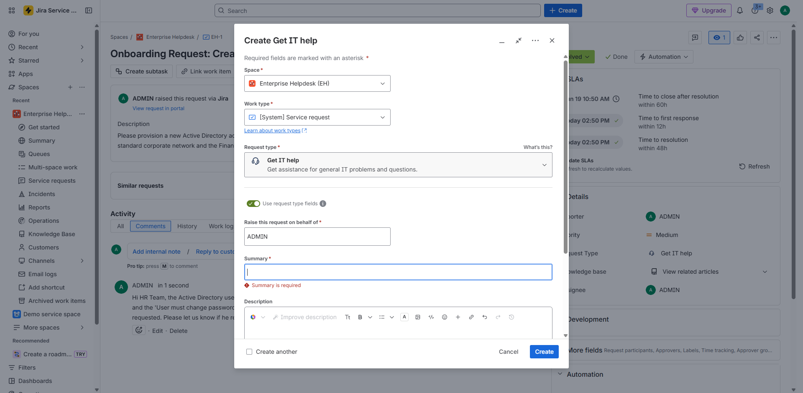
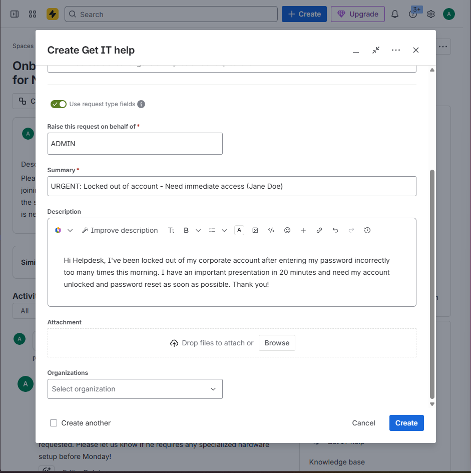
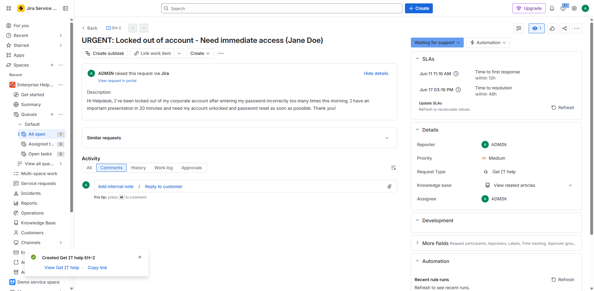
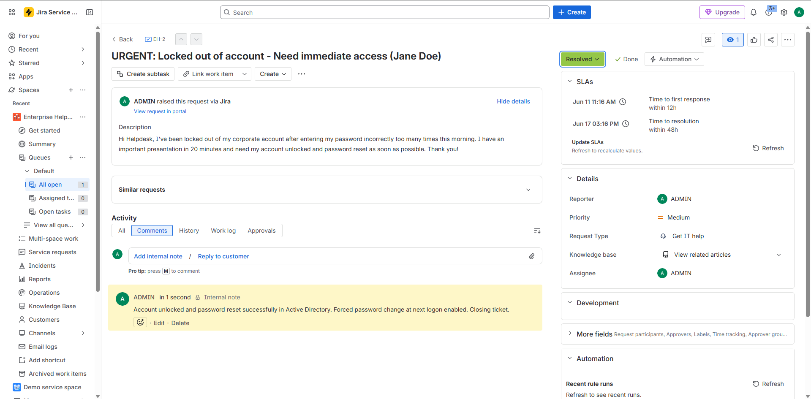

work further # IT Helpdesk Account Lockout & Recovery Simulation (Jane Doe)

## Project Overview
This project demonstrates how to resolve an urgent employee account lockout from start to finish. The workflow begins with the user experience—submitting a support request through the Jira customer portal. From there, I stepped into the role of an IT Support Technician to triage the ticket, access the Windows Server lab environment via VirtualBox, and use Active Directory Users and Computers (ADUC) to safely unlock the profile and reset credentials following standard password security compliance.

## Tools Used
* **Ticketing System:** Jira Service Desk (Cloud)
* **Identity Management:** Windows Server (Active Directory)
* **Virtualization Hypervisor:** Oracle VirtualBox

---

## Step-by-Step Project Walkthrough

### Part 1: Ticket Creation & Triage in Jira

#### 1. Submitting the Support Request
An employee (Jane Doe) experiences an account lockout and utilizes the Jira Service Desk customer portal to submit an urgent access recovery ticket.

#### 2. Reviewing the Incoming Queue
Logging into the Jira agent dashboard to locate the newly submitted account lockout ticket sitting in the open incident queue.

#### 3. Assigning and Owning the Ticket
Moving the ticket out of the unassigned pool and assigning it to my administrator profile to take formal ownership of the issue.

---

### Part 2: Account Recovery & Password Reset in Active Directory

#### 4. Verifying the Directory State
Launching Active Directory Users and Computers (ADUC) inside the Windows Server domain environment to inspect the `_Employees` organizational unit and check Jane Doe's account status.

#### 5. Executing the Reset & Account Unlock
Opening Jane Doe's user object properties to clear the account lockout flag, apply a secure temporary password string, and enforce a password change at the next system logon.

#### 6. Confirming Directory Object Changes
Reviewing the final confirmation summary screen within the Active Directory administrative wizard before committing the modification to the domain database.

#### 7. Final Active Directory Verification
Confirming that the user object properties successfully updated and saved inside the live operational container list next to the other domain profiles.

---

### Part 3: Documentation & Ticket Closure

#### 8. Logging the Internal Audit Note
Adding a comprehensive technical comment directly to the Jira ticket history detailing the password policy adjustments and verification parameters for formal documentation.

#### 9. Submitting the Resolution Form
Filling out the administrative closure parameters, inputting the system resolution codes, and updating the final work status.

#### 10. Final Ticket Closure Status
Verifying the final view of the IT service desk workspace to ensure the incident has been officially and successfully archived as 'Done'.

