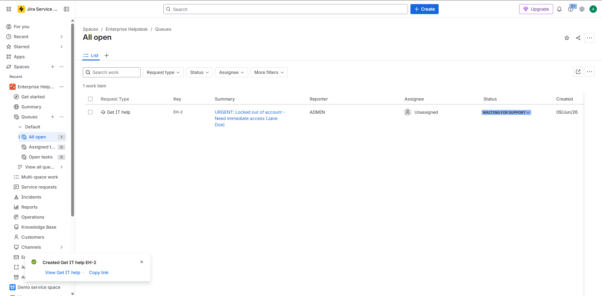
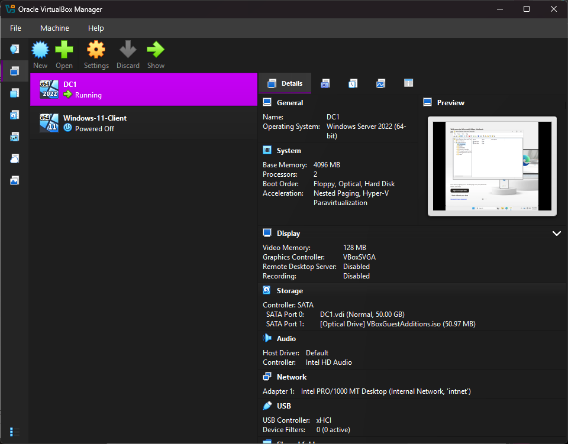
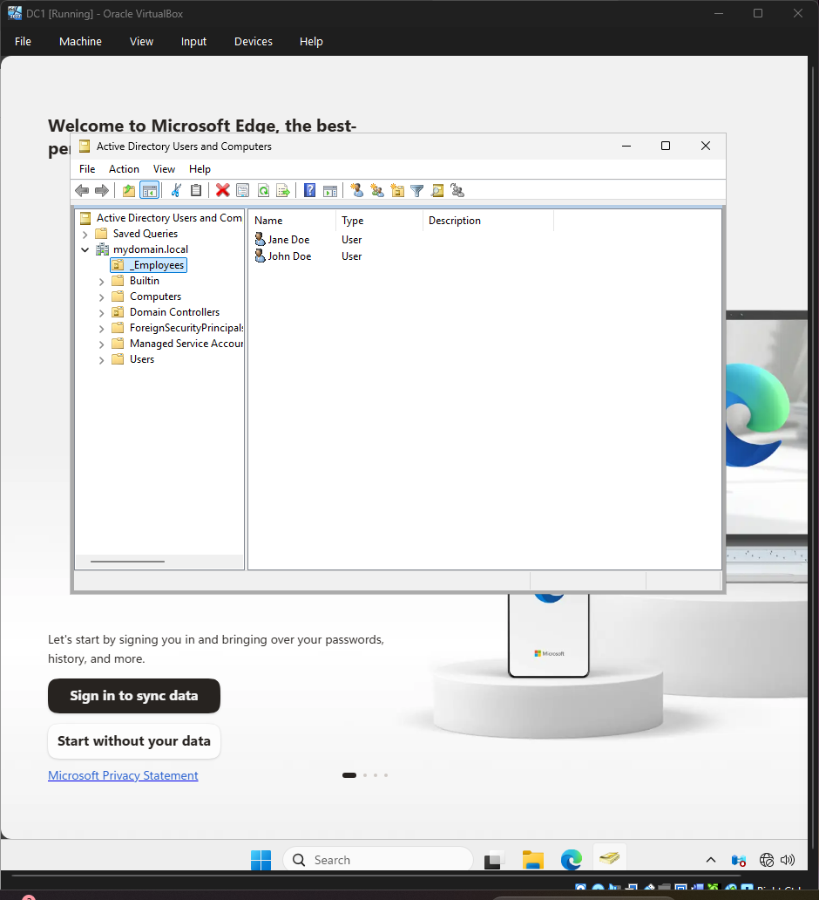
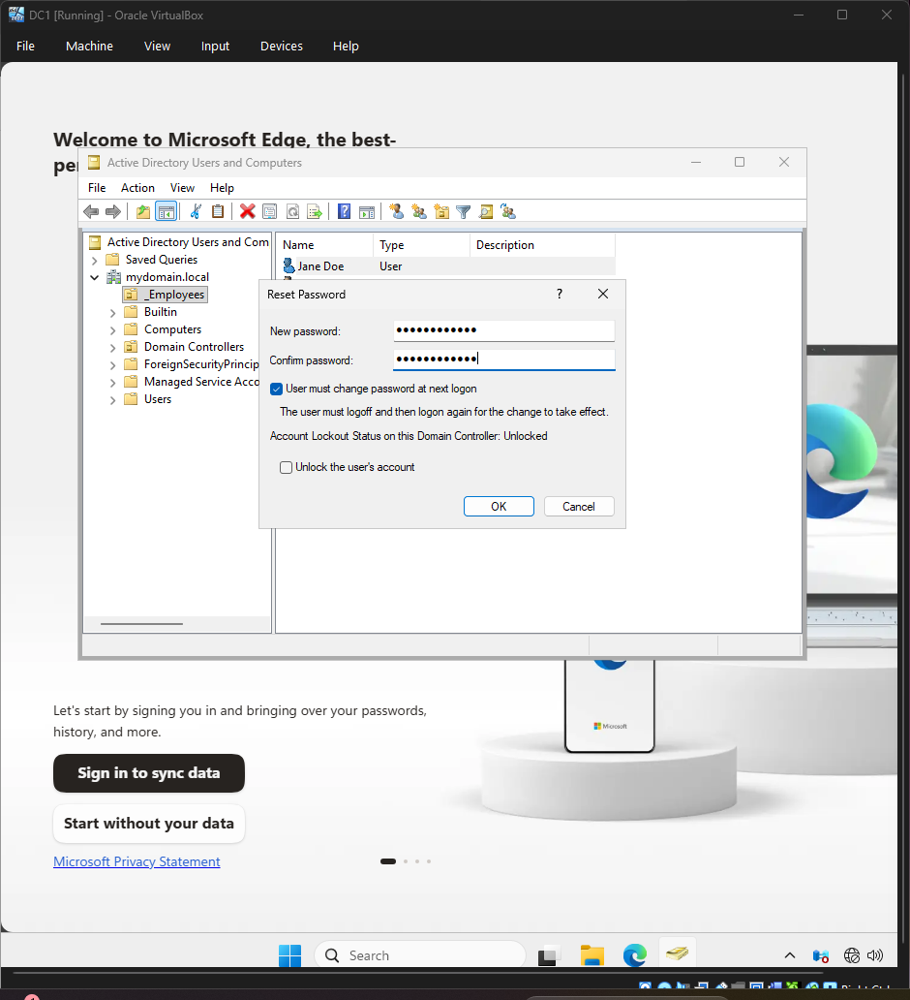
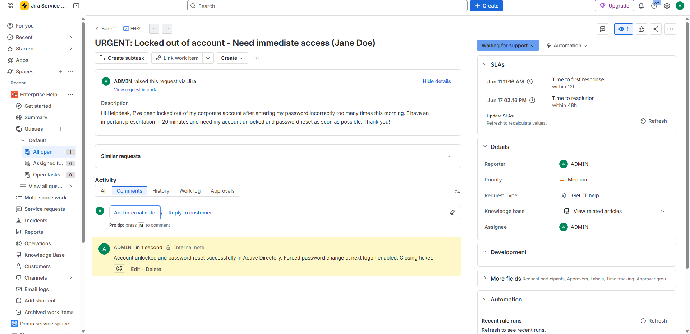
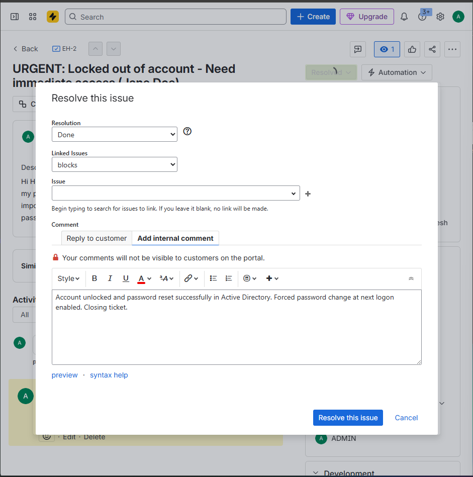

# Enterprise IT Support & Identity Management Pipeline: End-to-End Ticket & Active Directory Fix

## 📋 Project Overview
This project shows how to handle an urgent employee account lockout from start to finish. The workflow starts with a user submitting a help ticket in the Jira customer portal. From there, I acted as the IT Support Technician to check the ticket, log into the Windows Server environment using VirtualBox, and use Active Directory Users and Computers (ADUC) to unlock the account and reset the password safely.

---

## 🎯 Project Goals
* **Fast Resolution:** Fix the critical account lockout quickly to help the employee get back to work.
* **Keep Clean Logs:** Make sure all changes made to the server are documented inside the internal ticket notes.
* **Secure Passwords:** Force the user to change their temporary password the very next time they log in.

---

## 💻 Tools & Setup

| Tool | Technology | What it Does |
| :--- | :--- | :--- |
| **Ticketing System** | Jira Service Management (Cloud) | Manages incoming user help tickets and tracking. |
| **Virtual Machines** | Oracle VirtualBox Manager | Hosts the virtual server and client machines safely. |
| **Directory Services** | Active Directory (AD DS) | Manages user accounts and passwords for the network. |
| **Server OS** | Windows Server | Acts as the main Domain Controller (`DC-01`). |
| **Client OS** | Windows 11 Pro | Acts as the employee's workstation (`W11-CLIENT-01`). |

### Network Setup
To keep things secure and isolated from my home network, the lab uses a private internal network:
* **Network Name:** `intnet`
* **Domain Name:** `mydomain.local`
* **Domain Controller (DC-01):** Has a static IP and manages Active Directory, DNS, and DHCP.
* **Client Machine:** Gets its IP automatically from the server and is joined to the domain.

---

## 📜 Step-by-Step Lab Walkthrough

### Phase 1: Ticket Creation & Ingestion

#### Step 1: Submitting the Support Request
An employee experiences an account lockout and uses the Jira Service Management customer portal to submit an urgent help request.

#### Step 2: Reviewing the Incoming Queue
The new ticket lands in the centralized Helpdesk queue where it is automatically categorized so an agent can pick it up.

#### Step 3: Assigning and Owning the Ticket
The technician opens the ticket to review the details, view the resolution countdown timers, and assign the ticket to themselves.

---

### Phase 2: Server Infrastructure Check

#### Step 4: Checking the Server Status
Before opening any administrative software, the technician checks VirtualBox to ensure the Domain Controller is running correctly on the isolated network.

---

### Phase 3: Active Directory Account Fixes

#### Step 5: Finding the User Account
The technician logs into the Domain Controller and opens Active Directory Users and Computers (ADUC), navigating to the `_Employees` folder to find the locked-out user.

#### Step 6: Unlocking the Account & Resetting the Password
The technician opens the user properties, clears the account lockout checkmark, sets a secure temporary password, and checks the box to force a password change at the next login.

---

### Phase 4: Documentation & Ticket Closure

#### Step 7: Logging the Internal Audit Note
With the account successfully fixed on the server, the technician writes a clear summary of the changes directly into the ticket's internal notes.

#### Step 8: Submitting the Resolution Form
The technician fills out the final resolution form, sets the closure codes, and moves the ticket out of the active work queue.

#### Step 9: Final Ticket Closure Status
The ticket status updates to Resolved. The processing timers stop, and the completed ticket is archived in the system database.

---

## 🔍 Key Takeaways
* **Password Safety:** Forcing a password change at next login ensures that only the end user knows their final password, keeping the account secure.
* **Workflow Sync:** This project demonstrates how professional IT teams use tracking tickets as a central guide to fix problems on the server back-end.
* **Quick Support:** Efficient troubleshooting helps fix user lockouts in minutes, preventing any major disruptions to company operations.
